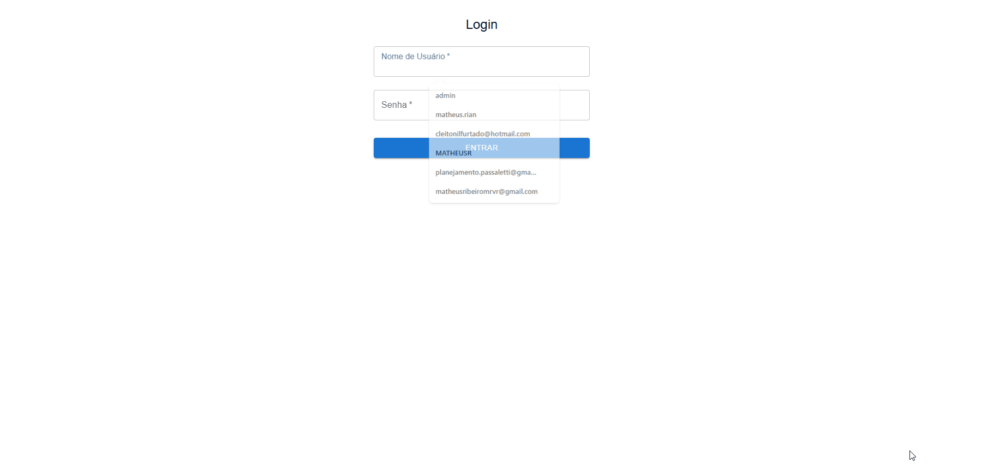

# Dashboard de Análise de Produto (MVP)

Este é um protótipo funcional (MVP) de uma ferramenta de Business Intelligence que criei para modernizar a análise de performance de produtos, substituindo processos manuais em Excel por uma visualização de dados ágil e interativa.

## 🎬 Demonstração

## O Desafio

A análise de performance de produtos é um pilar estratégico no varejo, mas muitas vezes depende de relatórios manuais em Excel. Esse processo é lento, propenso a erros e consome um tempo valioso que poderia ser usado em análises mais profundas. Meu objetivo foi criar uma solução para esse gargalo.

## ✨ A Solução

Desenvolvi uma aplicação web full-stack que fornece uma visão de **sell-out** clara e consolidada. A ferramenta realiza um processo de ETL (Extração, Transformação e Carga) para unificar dados de diferentes fontes e os apresenta em um dashboard interativo e seguro.

### Funcionalidades Implementadas:
* **Autenticação de Usuário:** Sistema de login seguro com Tokens JWT.
* **Busca Dinâmica:** Pesquisa de produto em tempo real.
* **Card de KPIs:** Um resumo gerencial com os indicadores mais importantes do produto.
* **Visualização Híbrida:** Alternância entre gráfico de barras e tabela detalhada para análise histórica.
* **ETL Robusto:** Pipeline de dados que processa arquivos CSV de estoque e se conecta a um banco de dados SQL Server para buscar dados de vendas e entradas.

## 🏛️ Arquitetura e Stack

A aplicação segue uma **arquitetura desacoplada** moderna, com uma API independente e uma SPA (Single-Page Application).

`Usuário (Browser)` → `Frontend na Vercel (React)` → `Backend na Render (API FastAPI)` → `Banco de Dados na Render (PostgreSQL)`

* **Backend:** Python, FastAPI, SQLAlchemy, PyODBC, Pandas
* **Frontend:** React.js, Material-UI (MUI), Chart.js, Axios, React Router
* **Banco de Dados:** PostgreSQL
* **Fonte de Dados do ETL:** Arquivos CSV e SQL Server

## 🧠 Principais Aprendizados e Desafios Superados

* **Engenharia de Dados:** O maior desafio foi construir o pipeline de ETL, lidando com fontes de dados complexas (arquivos de 80MB) e inconsistentes. A solução foi criar um script robusto em Pandas que limpa, agrega e modela os dados (`Estoque Inicial` + `Entradas` - `Vendas` = `Estoque Final`).
* **Dependências de Front-end:** Enfrentei (e resolvi) múltiplos problemas de compatibilidade de versão no ecossistema React/Chakra UI, o que me forçou a adotar uma abordagem mais resiliente com o Material-UI e a gerenciar as dependências de forma mais rigorosa.
* **Deploy Full-Stack:** Aprendi na prática o processo completo de deploy de uma aplicação moderna, configurando variáveis de ambiente, CORS para produção e publicando serviços independentes no Render e na Vercel.

## 🔮 Roadmap Futuro
* Automatizar o ETL para rodar diariamente na nuvem (Cron Job).
* Expandir para um dashboard com visão de múltiplos produtos.
* Implementar filtros avançados (regional, departamento, etc.).
* Implementação de rate limiting no endpoint de login para prevenir ataques de força bruta e revisão de queries para proteção contra SQL Injection.
* Implementação de um sistema de Refresh Tokens para o JWT, aumentando a segurança contra roubo de tokens e permitindo sessões de longa duração com tokens de acesso de vida curta.

##  Autor

**Matheus Ribeiro**

* **LinkedIn:** https://www.linkedin.com/in/matheus-ribeiro-a9992a206
* **GitHub:** https://github.com/Matheus-Ribeiro-dev
